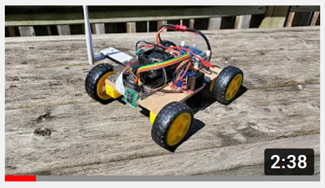
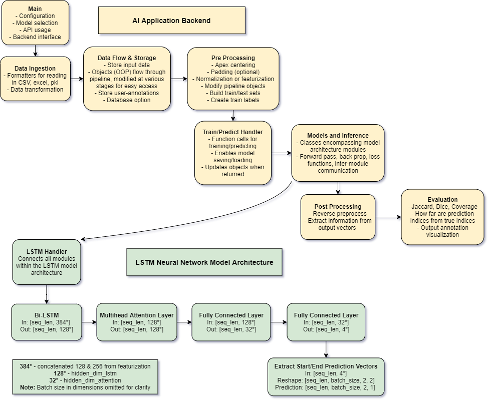
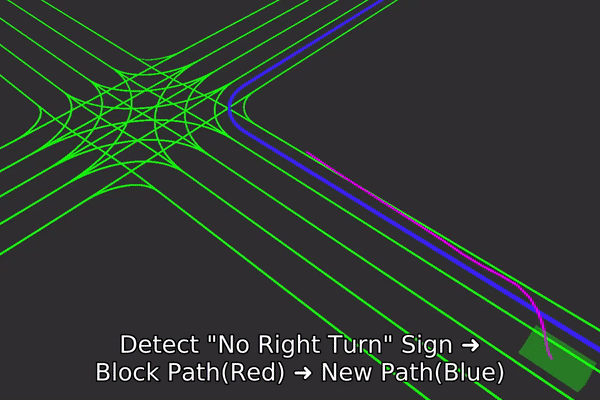
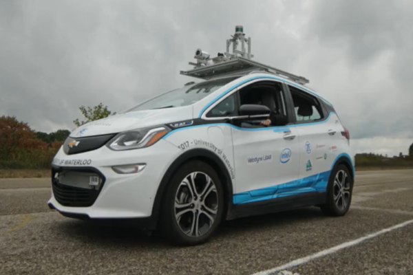
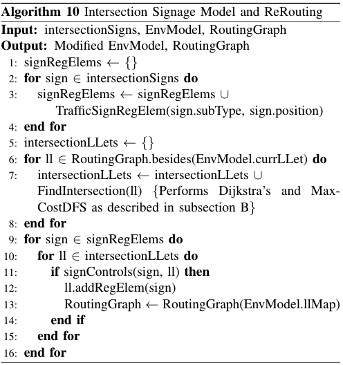
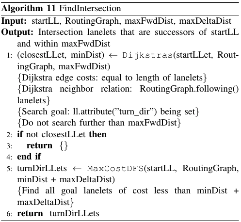
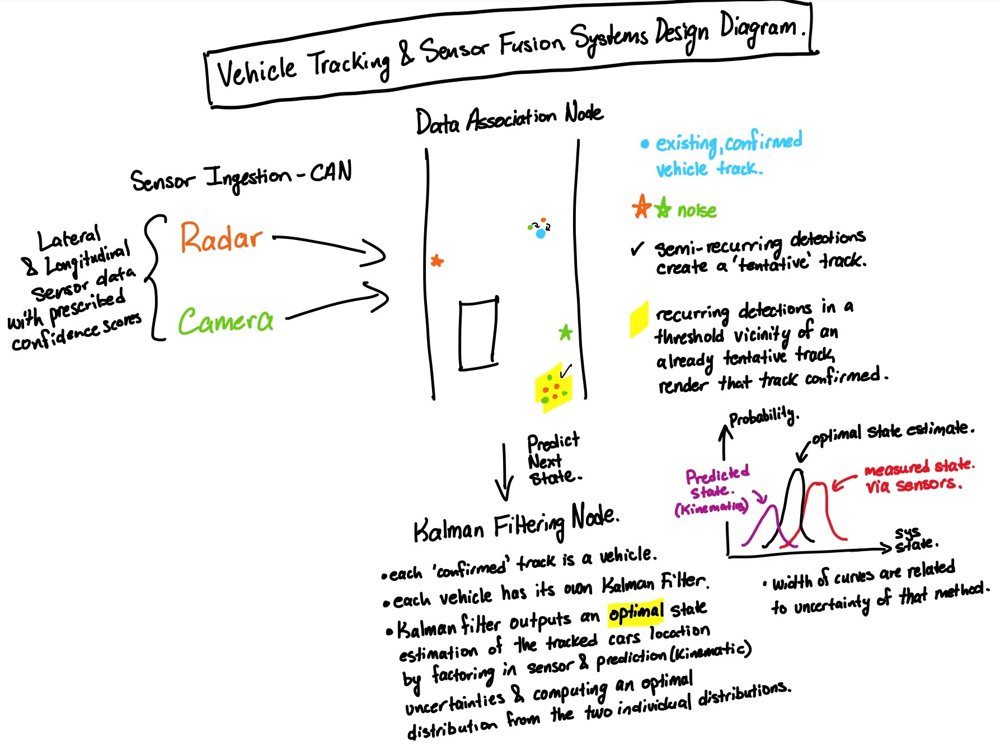
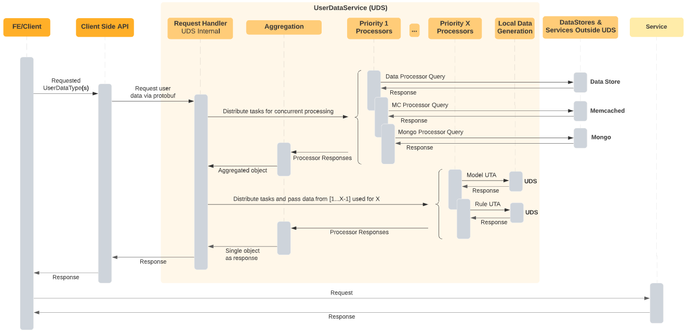

# Portfolio 
#### [Optionally, click here for my Github homepage to browse outside the portfolio 😊](https://github.com/MaahirG)

## Project 1: Software stack from scratch for my autonomous mini car
### Demo showing various software modules coming together for autonomous driving.

#### [YouTube Explainer:](https://www.youtube.com/watch?v=LI7HEokgCKs)

#### Behind the scenes

- [x] Physical car built + wired
- [x] Controlled by analog joystick 
- [x] Arduino control over the internet
- [x] Linux + interfaced camera + built out a ROS network for video streaming

 Click for entire progression! 

  
- [x] Controlled the car from my laptop with a PS3 controller OTA
- [x] Upgraded from a RPi to a Jetson Nano
- [x] Packages, environment setup PAIN, Linux
- [x] Built out an obstacle detection pipeline with RPi camera
- [x] Pipeline too choppy, used TensorRT for ~20fps
- [x] Switched from following car with a cord plugged into the wall to a LiPo battery
- [x] Started playing with occupancy maps + visualizations
- [x] Brainstormed and banged head to make the occupancy grid work properly
- [x] Motor interfacing difficulties
- [x] A* route planning within the occupancy map
- [x] SD card not booting up, new OS and dev environment from scratch, PAIN.
- [x] Mapped real world obstacles into the occupancy map frame
- [x] Realtime movement in the occupancy map: arrow keys to actual car movements
- [x] Built out spline generation for smooth path planning
- [x] Realtime route change based on obstacles
- [x] Multiprocessing for path planning + camera streaming concurrency
- [x] Made occupancy map prettier
- [x] tested, debugged, tested x7, debugged x4
- [x] Must've missed a few things! :)
Thank you for reading! The journey becomes 1000x better when somebody else walks through it too!

#### [Code Repo](https://github.com/MaahirG/SmartCar)

 

## Project 2: Machine Learning Application, Backend Workflow (ML+SWE Intern)
Hands on with the entire ML lifecycle: from research, problem identification, stakeholder meetings, model implementation, train/test/eval/tune etc, to building an entire system backend interfaceable by a frontend webapp, while also starting with AI deployment and MLOps.

Censored codebase design for a deep learning based auto-annotating scientist aid within the realm of Mass Spectrometry (private code repo):

  

#### Behind the scenes

- [x] Research papers
- [x] Learning about different DL model architectures
- [x] Built tool for data ingestion and DL related tasks
- [x] Model implementation in PyTorch
- [x] Model train, test, eval, tune etc (lifecycle)
- [x] Built application backend
- [x] Modularized and made scalable
- [x] Compatibility with front end webapp
- [x] Learnt fundamentals of ML deployment
- [x] Preparing for ML deployment
- [x] Weekly presentations and occasional reports

 

## Project 3: Software + Publication - Path Planning & Environment Modeling for Chevy Bolt EV - WATonomous Design Team
### Showcasing one usecase of my code contribution towards real-road autonomous driving.

  
  

#### [Research Paper + Code Repo](https://github.com/MaahirG/EnvModelingResearchPaper)

#### Behind the scenes
- [x] Co-authored research paper - candidate for ICRA, iROS and RA-L IEEE Robotics conferences and societies.
- [x] Algorithm: Dijkstra search + iterative max depth DFS + Embed the meaning of perceived signs in RoutingGraph
- [x] SWE Fundamentals - big codebase - CI
- [x] Entire AV software stack chugging away (ROS + Docker)
- [x] Local planning module (pink line)
- [x] Environment modeling module (main focus of demo) 
- [x] Mock perception data publisher (Carla Simulation)
- [x] Simulation(rviz) & more! :)
- [x] Unfortunately entire AV system is a private repo

#### Algorithm Pseudocode

  
  

## Project 4: Vehicle Tracking System Diagram - Sensor Fusion on EcoCar Design Team

  

## Project 5: Backend Microservice Design from Internship
#### Owned, architected and built a centralized data access microservice based on 4 pillars: concurrency, expandability, modularity, usability.

  

# [Resume](./MaahirGuptaResume.pdf)
