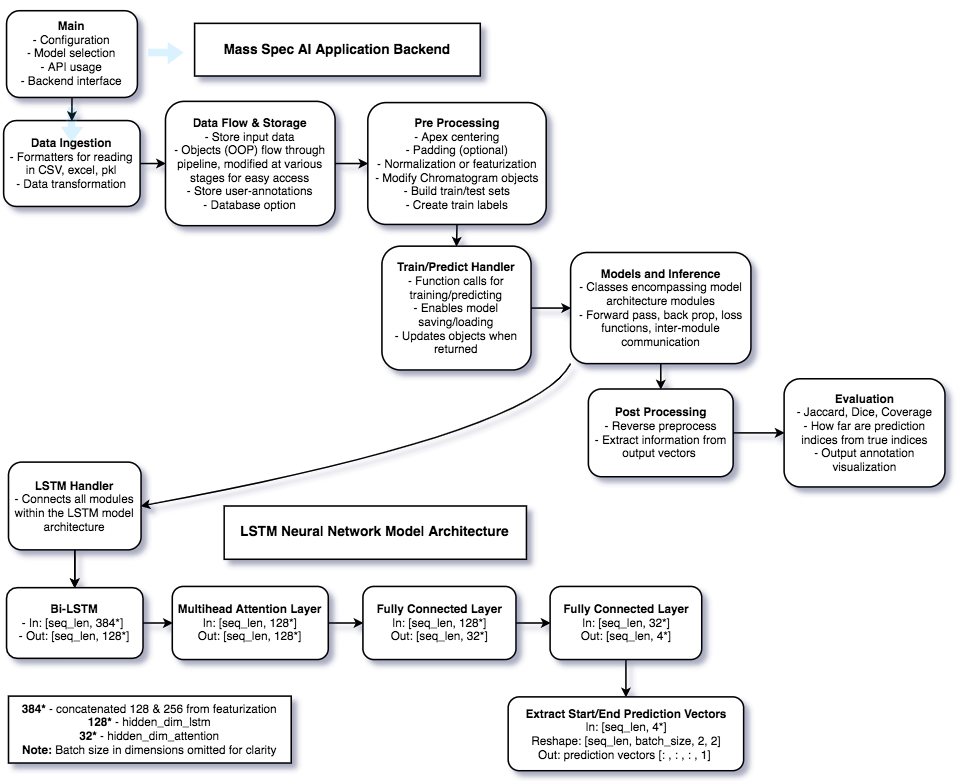

# Project Portfolio 
#### [You can also click here for my Github homepage to browse outside the portfolio 😊](https://github.com/MaahirG)

  

## Project 1: Software stack from scratch for my autonomous mini car
### Project demo showing various software modules coming together for my autonomous mini car.

### [Click me for the code repo](https://github.com/MaahirG/SmartCar)
### Behind the scenes & Progression or Scroll down for Project 2!
* Python & C++
* Physical car built + wired
* Controlled it with an analog joystick + arduino over the internet
* Linux + interfaced a camera + built out a ROS network for video streaming
* Controlled the car from my laptop over the internet with a PS3 controller
* Upgraded from a RPi to a Jetson Nano
* Packages, environment setup PAIN, Linux
* Built out an obstacle detection pipeline with the RPi camera
* Pipeline too choppy, so used TensorRT for ~20fps
* Switched from following car with a cord plugged into the wall to a LiPo battery
* Started playing with occupancy maps + visualizations
* Brainstormed and banged head to make the occupancy grid work properly
* Motor interfacing difficulties
* A* route planning within the occupancy map
* SD card not booting up, new OS and dev environment from scratch (ty Github) but PAIN.
* Mapped real world obstacles into the occupancy map frame
* Realtime movement in the occupancy map: arrow keys to actual car movements
* Built out spline generation for smooth path planning
* Implemented realtime route change based on obstacles
* Implemented multiprocessing for path planning and camera streaming separation and concurrency
* Made the occupancy map prettier
* tested
* debugged
* tested x7
* debugged x4
* Must've missed a few things! :)

I seriously thank you for reading through that, the journey becomes 1000x better when somebody else takes the time to walk through it too!

## Project 2: High Lvl Software - Path Planning + Environment Modeling for a Chevy Bolt EV
### One part of my code contribution towards autonomous driving on real roads.

  
  

### Behind the scenes
* C++
* Co-authored a research paper based on this environment model idea. Candidate in iROS and RAL conferences.
* Algorithm: Dijkstra search + iterative max depth BFS + Embed the meaning of perceived signs in RoutingGraph
* SWE Fundamentals - big codebase - CI
* Entire AV software stack chugging away (ROS + Docker)
* Local planning module (pink line)
* Environment modeling module (main focus of demo) 
* Mock perception data publisher (Carla Simulation)
* Simulation(rviz) & more! :)
* Unfortunately private Github repo
